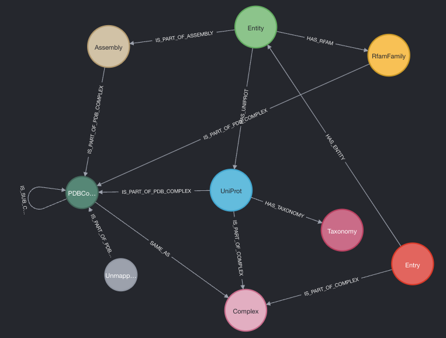

# PDBe Complex Analysis Demo

This repository helps in creating a demo dataset for Neo4J to perform complex analysis. The demo dataset is a subset of the [PDBe Graph Database](https://www.ebi.ac.uk/pdbe/pdbe-kb/graph). This dataset would showcase how the PDBe Graph Database can be used to perform complex analysis instead of downloading the entire dataset which is about 600GB uncompressed.

> **NOTE:** This is a demo dataset and is not a substitue for the PDBe Graph Database. This dataset only includes nodes and relationships that are required for complex analysis. The same applies to the properties of the nodes and relationships. The properties are only a subset of the properties that are available in the PDBe Graph Database.

This is a Python package that can be installed using pip. The package contains a set of utilities to create the dataset. The list of utilities are described in the features section.

## Methodology
The methodology used to create the dataset is as follows:
When a PDB entry is loaded into the database, the following nodes and relationships are created. The nodes and relationships are created based on the data available for the PDB entry. We use SIFTS mappings to connect the PDB entry to the UniProt entry.


Then we use the publicly available [data](https://ftp.ebi.ac.uk/pub/databases/IntAct/current/various/complex2pdb/released) from [complex portal](https://www.ebi.ac.uk/complexportal/home) to map the released complex portal entries to the PDB and UniProt nodes.
This process creates the following nodes and relationships.


Now that we have the nodes and relationships, we can use the following Cypher query to create the unique combination of components.

```cypher
MATCH (assembly:Assembly {PREFERED: 'True'})<-[rel:IS_PART_OF_ASSEMBLY]-(entity:Entity {TYPE:'p'})
WITH assembly, rel, entity
OPTIONAL MATCH (entity)-[:HAS_UNIPROT {BEST_MAPPING:'1'}]->(uniprot:UniProt)-[:HAS_TAXONOMY]->(tax:Taxonomy)
OPTIONAL MATCH (entity)-[:HAS_RFAM]->(rfam:RfamFamily)
WITH assembly.UNIQID AS assembly_id,
CASE uniprot
    WHEN null
        THEN
            CASE rfam
                WHEN null
                    THEN
                        CASE entity.POLYMER_TYPE
                            WHEN 'R'
                                THEN 'RNA' +':UNMAPPED'
                            WHEN 'D'
                                THEN 'DNA' +':UNMAPPED'
                            WHEN 'D/R'
                                THEN 'DNA/RNA' +':UNMAPPED'
                            WHEN 'P'
                                THEN 'NA_' +entity.UNIQID +'_' +rel.NUMBER_OF_CHAINS
                        END
                ELSE
                    rfam.RFAM_ACC
            END
    ELSE uniprot.ACCESSION +'_' +rel.NUMBER_OF_CHAINS +'_' +tax.TAX_ID
END AS accession ORDER BY accession
WITH assembly_id AS assembly_id, COLLECT (DISTINCT accession) AS accessions
WITH assembly_id AS assembly_id, REDUCE(s = HEAD(accessions), n in TAIL(accessions) | s +',' +n) AS accessions
WITH accessions, COLLECT(DISTINCT assembly_id) AS assemblies
WITH accessions AS accessions, REDUCE(s = HEAD(assemblies), n in TAIL(assemblies) | s +',' +n) AS assemblies
RETURN accessions, assemblies
```

Once the unique combination of components are created, we use this data to assign them a unique identifier. This identifier is used to create the PDBComplex nodes and relationships to the other component nodes. We currently use cross references to UniProt and Rfam accessions to create/link the components. Rest of the entities are considered as an unmapped polymer.

> Please note that the demo project doesn't persist the unique identifier for the PDBComplex nodes. So you may get different identifiers for the same complex when you run the above query multiple times on different dataset.

We also run the below query to identify the subcomplexes of the complexes. Then we use this data to link PDBComplex nodes using **IS_SUB_COMPLEX_OF** relationships.

```cypher
MATCH
    (src_complex:PDBComplex)<-[rel1:IS_PART_OF_PDB_COMPLEX]-()-[rel2:IS_PART_OF_PDB_COMPLEX]->(dest_complex:PDBComplex)
    WHERE rel1.STOICHIOMETRY=rel2.STOICHIOMETRY
WITH DISTINCT src_complex, dest_complex, rel1
WITH src_complex, startNode(rel1) AS relRelations, dest_complex
WITH src_complex, COUNT(relRelations) AS relRelationsAmount, dest_complex
MATCH (src_complex)<-[allRelations:IS_PART_OF_PDB_COMPLEX]-()
WITH src_complex, relRelationsAmount, count(allRelations) AS allRelationsAmount, dest_complex
    WHERE relRelationsAmount = allRelationsAmount
CREATE (dest_complex)<-[:IS_SUB_COMPLEX_OF]-(src_complex)
```

The resulting dataset will have the following nodes and relationships.




### Data sources
Below are the data sources used to create the dataset.

- PDBe updated mmCIF file
  - eg: https://www.ebi.ac.uk/pdbe/entry-files/download/2gcv_updated.cif
- Rfam mappings (PDBe API)
  - eg: https://www.ebi.ac.uk/pdbe/api/nucleic_mappings/rfam/2gcv
- PDBe assembly XML
  - eg: https://www.ebi.ac.uk/pdbe/static/entry/download/4v6c-assembly.xml
- UniProt entry JSON (UniProt API)
  - eg: https://rest.uniprot.org/uniprotkb/Q14676.json
- Complex Portal mappings as TSV files ([IntAct public FTP](https://ftp.ebi.ac.uk/pub/databases/IntAct/current/various/complex2pdb/released))

## Get started
The below steps will help you to install the package and create the dataset.

### Using docker
Use the below steps to create the dataset using docker. This is the easiest way to get started.

#### Start the docker containers

```bash
docker compose up -d
```

> The above command will take some time to start the containers for the first time.

This will start the Neo4J container and is available at http://localhost:7474. The default username and password is `neo4j`/`pdbe_demo`. You can change the password in the `docker-compose.yml` file.


#### Use the CLI tool

Now that the containers are up and running, you can use the CLI tool to create the dataset.

For eg. to create the dataset for the PDB entries `1cbs` and `3gfr`, use the following command.

```bash
docker compose exec cli pdbecomplexes_demo load-entries --entries 1cbs,3d12
```

A list of sample entries are available in the `sample/entries.txt` file. Use the below command to load the sample entries.

```bash
docker compose exec cli pdbecomplexes_demo load-entries --entries sample/entries.txt
```

Load the complex portal data using the below command.

```bash
docker compose exec cli pdbecomplexes_demo load-complex-portal-data
```

Perform the complex analysis using the below command.

```bash
docker compose exec cli pdbecomplexes_demo run-pdbe-complex-analysis
```


You may use the help section of CLI to find available commands. Use the below command to get the help section.

```bash
docker compose exec cli pdbecomplexes_demo --help
```

Also refer to the features section below to find out more about the CLI tool.


### Outside container

The below steps will help you to install the package and create the dataset by not using the docker.

#### Requirements
* [Neo4J 3.5.x](https://neo4j.com/download-center/) or above
* Python 3.8.x or above

#### Install Neo4J

Use the download center to download and install Neo4J. Once installed, start the Neo4J server. The default username and password is `neo4j`/`neo4j`. You may be asked to change the password on first start of the instance.

#### Test the Neo4J connection

By default, Neo4J is available at http://localhost:7474. You can use the following command to test the connection.


#### Create a virtual environment
```bash
python3 -m venv venv
source venv/bin/activate
```

#### Install the package
```bash
pip install .
```

The above command will install the package and all the dependencies. There is a CLI tool called `pdbecomplexes_demo` that can be used to call the commands to various features. Please refer to the features section below for more details.


#### Set the environment variables

Add the following environment variables to `.env` file in current directory.

```bash
NEO4J_URI=bolt://localhost:7687
NEO4J_USER=<NEO4J USERNAME>
NEO4J_PASSWORD=<NEO4J PASSWORD>
```


## Features
Below are the list of features that are available in the package. Use the `pdbecomplexes_demo --help` command to get the list of available commands.

* Schema index creation:
  This utility can be used to create the schema indexes required for the dataset. It helps in speeding up the queries.
* Remove all nodes and relationships:
  This utility can be used to remove all the nodes and relationships from the database.
  >**Warning**: This utility will remove all the nodes and relationships from the database. Use it with caution.
* Load a single PDB entry:
  This utility can be used to load a single PDB entry into the database.
* Load a list of PDB entries:
  This utility can be used to load a list of PDB entries into the database. The list can be a file containing a list of PDB entries or a list of PDB entries, comma separated.

  > There is a sample file available in the `sample` directory. You can use that file to load the PDB entries into the database.
  For eg. `pdbecomplexes_demo load-entries --entries sample/entries.txt`

* Load complex portal data:
  This utility can be used to load the complex portal data into the database. The complex portal data is a list of complexes and their components. This is a public dataset and can be downloaded from [here](https://ftp.ebi.ac.uk/pub/databases/IntAct/current/various/complex2pdb/released/).
* Run the complex analysis:
  This utility can be used to run the complex analysis. The complex analysis will create the PDBComplex nodes and relationships to the other component nodes. It will also create the subcomplex relationships.


So in an ideal scenario, you can use the following steps to create the dataset.

`Create schema indexes` -> `Load PDB entries` -> `Load complex portal data` -> `Run complex analysis`

If you are loading more entries, make sure to run the load complex data and complex analysis after to get the data updated in the database. Also it's ideal to start with a clean database.
